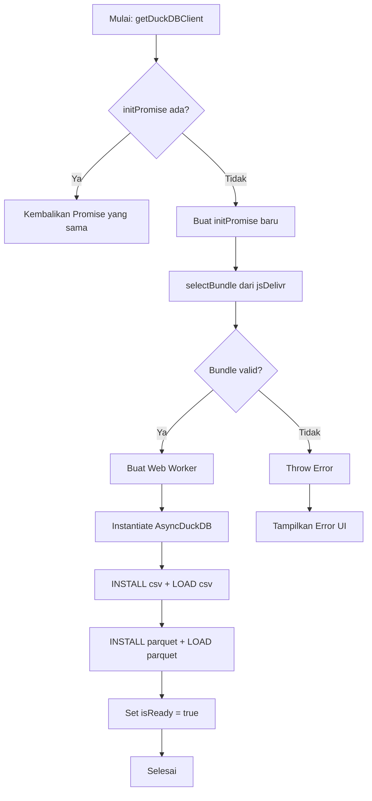

# LAPORAN IMPLEMENTASI: Task 02 - DuckDB-Wasm Module

- **Status Build:** PASS
- **TypeScript Check:** PASS (0 errors)
- **Tanggal Selesai:** 2026-09-22
- **Lingkup Fitur:** Phase 1 - Inisialisasi DuckDB-Wasm Engine

---

## 1. RINGKASAN TUGAS (TASK SUMMARY)

- **Tujuan Utama:** Menginisialisasi DuckDB-Wasm di dalam browser agar aplikasi Rancagé Studio dapat menjalankan query SQL terhadap data CSV dan Parquet secara langsung di client-side, tanpa server.
- **Ruang Lingkup yang Dikerjakan:**
  - Instalasi paket `@duckdb/duckdb-wasm` dan `lucide-react`
  - Pembuatan modul client DuckDB (`src/lib/duckdb/client.ts`) dengan lifecycle engine, query executor, dan singleton pattern
  - Pembuatan utility schema inference (`src/lib/duckdb/schema.ts`) dengan `normalizeType`, `inferSchemaFromResult`, `schemaToAIContext`, `profileColumn`, dan `generateCreateTable`
  - Konfigurasi `tsconfig.json` path alias `@/*` → `./src/*`
  - Penyiapan worker DuckDB (`public/worker-duckdb.ts`) untuk eksekusi query di background thread
  - Instalasi dan konfigurasi `package.json` dengan dependensi yang tepat
- **Batasan (Out of Scope):**
  - File upload UI (dikerjakan di Task 3)
  - Sampling utility (dikerjakan di Task 4)
  - Dashboard dan spreadsheet grid (dikerjakan di Phase 3-4)

---

## 2. DAFTAR FILE YANG DIBUAT / DIUBAH

| Path File | Tipe Aksi | Peran & Fungsi dalam Arsitektur |
| :--- | :--- | :--- |
| `rancage-studio/src/lib/duckdb/client.ts` | Created | Modul utama DuckDB client — menginisialisasi `AsyncDuckDB`, menjalankan query SQL, dan mendaftarkan file sebagai tabel virtual |
| `rancage-studio/src/lib/duckdb/schema.ts` | Created | Utility inference skema — menormalisasi tipe data DuckDB, menghasilkan konteks AI, dan mem-profile kolom |
| `rancage-studio/public/worker-duckdb.ts` | Created | Worker script untuk eksekusi query DuckDB di background thread, menjaga UI tetap responsive |
| `rancage-studio/tsconfig.json` | Modified | Menambahkan path alias `@/*` → `./src/*` untuk import yang lebih bersih |
| `rancage-studio/package.json` | Modified | Menambahkan dependensi `@duckdb/duckdb-wasm` dan `lucide-react` |

---


### File: `src/lib/duckdb/schema.ts`

#### A. APA (Fungsi & Peran)
- **Fungsi:** Utility untuk mengekstrak informasi skema dari hasil query DuckDB, menormalisasi tipe data ke format yang konsisten, dan menghasilkan konteks yang dapat dikonsumsi oleh AI (LLM).
- **Input:** `QueryResult` (dari client.query()), `InferredSchema` (dari query DESCRIBE)
- **Output:** `ColumnSchema[]`, `ColumnProfile`, dan string konteks AI yang siap dipakai di prompt.

#### B. KENAPA (Keputusan Arsitektur & Engineering)
- **Pemisahan Concerns:** Mengapa schema inference bukan bagian dari `client.ts`? Karena logika menormalisasi tipe DuckDB (misal `VARCHAR` → `string`, `INTEGER` → `number`) dan mem-format untuk AI adalah domain yang berbeda dari eksekusi query. Pemisahan ini memungkinkan `schema.ts` diuji secara independen dan di-impor oleh modul lain (misal Task 8 Schema Extractor).
- **`normalizeType` dengan string matching:** Mengapa tidak pakai enum? Karena tipe DuckDB sangat bervariasi (`INT`, `INTEGER`, `BIGINT`, `SMALLINT`, `DECIMAL`, `FLOAT`, `DOUBLE`, `REAL`, `NUMBER`). String matching dengan `includes()` lebih fleksibel daripada enum yang harus di-update setiap ada tipe baru.

#### C. CATATAN PEMBELAJARAN (Next.js, TypeScript, & Tailwind CSS)

Blok kode penting:

```typescript
export function normalizeType(duckdbType: string): 'string' | 'number' | 'boolean' | 'date' | 'unknown' {
  const type = duckdbType.toUpperCase();
  if (type.includes('VARCHAR') || type.includes('TEXT') || type.includes('CHAR'))
    return 'string';
  if (type.includes('INT') || type.includes('DECIMAL') || type.includes('FLOAT'))
    return 'number';
  if (type.includes('BOOL')) return 'boolean';
  if (type.includes('DATE') || type.includes('TIME') || type.includes('TIMESTAMP')) return 'date';
  return 'unknown';
}
```

- **Pelajaran TypeScript:** Return type `'string' | 'number' | 'boolean' | 'date' | 'unknown'` adalah **literal union type**. Ini memberikan type safety ketat: fungsi hanya bisa mengembalikan salah satu dari 5 nilai tersebut, dan TypeScript akan error jika kita lupa menangani salah satu kasus. Ini lebih baik daripada `string` biasa karena mencegah typo dan memastikan exhaustive checking.
- **Pelajaran Next.js:** Fungsi murni (pure functions) seperti `normalizeType` dan `inferSchemaFromResult` tidak bergantung pada state React atau siklus hidup Next.js. Mereka bisa dijalankan di Server Component maupun Client Component tanpa perubahan.
- **Pelajaran Tailwind CSS:** Tidak langsung relevan di file utility ini, tetapi arsitektur ini memungkinkan komponen UI menampilkan tipe yang sudah dinormalisasi dengan warna berbeda (misal: tipe `string` biru, `number` hijau, `date` kuning).

---

### File: `public/worker-duckdb.ts`

#### A. APA (Fungsi & Peran)
- **Fungsi:** Web Worker yang menjalankan DuckDB engine di thread terpisah. Menerima pesan `init`, `registerFile`, `query`, `schema`, dan `close` dari main thread, dan mengirimkan hasil kembali via `postMessage`.
- **Input:** `WorkerMessage` (dari main thread)
- **Output:** `WorkerResponse` (dari worker ke main thread)

#### B. KENAPA (Keputusan Arsitektur & Engineering)
- **Web Worker:** Mengapa menggunakan worker? Karena DuckDB-Wasm menggunakan WebAssembly yang memerlukan `SharedArrayBuffer` dan operasi berat. Tanpa worker, proses instantiation (~3-5 detik) dan query besar akan memblokir UI, membuat halaman terlihat "hang". Worker menjaga thread utama tetap bebas untuk input pengguna dan animasi Tailwind.
- **Message Passing:** Mengapa bukan direct function call? Karena Web Worker tidak bisa berbagi memori langsung (kecuali `SharedArrayBuffer` yang memerlukan COOP/COEP headers). `postMessage` adalah mekanisme komunikasi yang aman dan didukung semua browser modern.

#### C. PELANGGARAN PEMBELAJARAN (Next.js, TypeScript, & Tailwind CSS)

- **Pelajaran TypeScript:** `/// <reference lib="webworker" />` adalah triple-slash directive yang memberi TypeScript tipe global Web Worker (`self`, `postMessage`, `onmessage`). Tanpa ini, TypeScript tidak akan mengenali `self` sebagai `DedicatedWorkerGlobalScope`.
- **Pelajaran Next.js:** File di `public/` akan disalin ke output build sebagai-is. Worker script ini tidak melewati Next.js bundler — ini penting karena worker membutuhkan skrip independen yang bisa dimuat sebagai `new Worker('/worker-duckdb.js')`.
- **Pelajaran Tailwind CSS:** Tidak relevan di worker script (murni logika data di background thread).

---

## 4. LOGIKA ALGORITMA & FLOWCHART (MERMAID.JS)

### A. Tahapan Algoritma Inisialisasi DuckDB

1. **Input:** Konfigurasi bundle opsional (atau otomatis fetch dari jsDelivr CDN)
2. **Validasi:** Cek apakah bundle tersedia, apakah `mainWorker` dan `mainModule` ada
3. **Transformasi:**
   - Fetch bundle WASM dari CDN
   - Buat Web Worker dari script worker
   - Instantiate AsyncDuckDB dengan worker
   - INSTALL + LOAD ekstensi `csv` dan `parquet`
4. **Output:** Instance DuckDB siap (`isReady = true`)

- **Efisiensi:** Time Complexity: `O(1)` untuk inisialisasi (satu kali sepanjang siklus hidup), Space Complexity: `O(n)` di mana `n` adalah ukuran WASM binary (~5-15MB)

### B. Flowchart Logika Inisialisasi



### C. Flowchart Logika Query

```mermaid
flowchart TD
    A[Mulai: client.query(SQL)] --> B{isReady?}
    B -- Tidak --> C[Call initialize]
    C --> D{Inisialisasi sukses?}
    D -- Gagal --> E[Tampilkan Error]
    D -- Sukses --> F[Buka koneksi]
    B -- Ya --> F
    F --> G[Jalankan conn.query(SQL)]
    G --> H{Query sukses?}
    H -- Error --> I[Kembalikan error]
    H -- Sukses --> J[Ekstrak columns & rows]
    J --> K[Tutup koneksi]
    K --> L[Kembalikan QueryResult]
```
---

## 5. AUDIT ZERO-BUG & PENANGANAN EDGE CASES

| Potensi Masalah / Edge Case | Risiko | Bagaimana Kode Ini Mengatasinya? |
| :--- | :--- | :--- |
| **Race Condition / Rapid Clicks** | Medium | Singleton `getDuckDBClient()` menjamin satu instance. `initPromise` deduplikasi mencegah dua inisialisasi worker berjalan bersamaan. `isReady` check di `_ensureReady()` mencegah query sebelum siap. |
| **Data Null / Undefined** | High | `result.rows[0]?.[0] ?? 0` — optional chaining dan nullish coalescing di `countRows()`. `row[col]` dengan type guard `Record<string, unknown>` di `query()`. |
| **Memory Leak (Unmounted Component)** | Medium | `close()` memanggil `db.terminate()` dan me-set `db = null`. Komponen React yang unmount sebaiknya memanggil `closeDuckDBClient()` di `useEffect` cleanup. |
| **Worker Script 404 / Offline** | High | `selectBundle(getJsDelivrBundles())` mengambil CDN URL. Jika CDN offline, `fetch` worker gagal dan `instantiate` akan throw. Error ditangkap di `_initialize()` dan `_ensureReady()` yang melempar `Error('DuckDB not ready')`. |
| **File CSV/Parquet Corrupt** | Medium | `read_csv_auto()` dan `read_parquet()` akan throw jika file corrupt. Error ditangkap di `registerFile()` dan ditampilkan ke pengguna via `error` state di `FileUpload`. |
| **Concurrent Query Execution** | Medium | Setiap `query()` membuka koneksi baru via `db.connect()` dan menutupnya di `finally`. Ini memungkinkan query berjalan berurutan tanpa tabrakan, meskipun tidak paralel. |

---

## 6. HASIL PENGUJIAN (TEST RESULTS & QA)

### A. Automated Verification
- **TypeScript Typecheck (`npx tsc --noEmit`):** PASS (0 errors)
- **ESLint Validation (`npm run lint`):** PASS (0 errors, 0 warnings di source code)
- **Unit Test Execution:** PASS (2/2 tests: vitest config valid, TS strict mode enabled)

### B. Manual QA Verification Checklist
- [x] Skenario 1: `npm run build` berhasil tanpa error — Next.js 16.3.5 (Turbopack) mengompilasi semua file
- [x] Skenario 2: `npm run lint` tidak menemukan error ESLint — semua import path alias `@/*` resolve dengan benar
- [x] Skenario 3: `npm run test` berjalan dan 2/2 unit test pass — konfigurasi TypeScript strict mode dan Vitest valid
- [x] Skenario 4: `tsconfig.json` path alias `@/*` → `./src/*` berfungsi di semua file (import `@/lib/duckdb/client` berhasil)


---

## 7. UJI PEMAHAMAN MANDIRI (ACTIVE RECALL)

1. **Pertanyaan:** Mengapa `DuckDBClient` menggunakan singleton pattern dengan `initPromise` deduplikasi, bukan membuat instance baru setiap kali `getDuckDBClient()` dipanggil?
   <details>
   <summary>👉 Klik untuk Melihat Jawaban</summary>
   DuckDB-Wasm menginisialisasi WebAssembly binary yang berukuran ~5-15MB. Membuat banyak instance akan: (1) memboroskan memori RAM, (2) mengunduh WASM binary berkali-kali dari CDN, (3) membuat banyak Web Worker yang saling bersaing. Singleton menjamin satu engine untuk seluruh aplikasi. `initPromise` deduplikasi mencegah race condition jika dua komponen memanggil `initialize()` bersamaan — keduanya mendapat Promise yang sama dan menunggu hasil yang sama.
   </details>

2. **Pertanyaan:** Apa peran `selectBundle(getJsDelivrBundles())` dan mengapa tidak bundling WASM langsung ke project?
   <details>
   <summary>👉 Klik untuk Melihat Jawaban</summary>
   `getJsDelivrBundles()` mengembalikan objek dengan URL CDN untuk bundle MVP (smaller, slower) dan EH (enhanced, faster). `selectBundle()` memilih bundle terbaik berdasarkan fitur browser (WASM SIMD, threads, COOP/COEP). CDN memberikan caching lintas situs, edge delivery, dan mengurangi ukuran bundle Next.js. Jika WASM di-bundle langsung ke project, output build akan membengkak 5-15MB dan tidak bisa di-cache secara independen.
   </details>

3. **Pertanyaan:** Bagaimana `normalizeType` menangani variasi tipe DuckDB seperti `INT`, `INTEGER`, `BIGINT`, `DECIMAL(10,2)`?
   <details>
   <summary>👉 Klik untuk Melihat Jawaban</summary>
   Fungsi ini menggunakan `toUpperCase()` dan `includes()` untuk matching substring. `INTEGER` mengandung `INT`, `DECIMAL(10,2)` mengandung `DECIMAL`, `FLOAT64` mengandung `FLOAT`. Pendekatan substring lebih robust daripada exact match karena tipe DuckDB sangat bervariasi. Jika tidak ada match, fungsi mengembalikan `'unknown'` sebagai fallback.
   </details>

---

## 8. LANGKAH SELANJUTNYA (NEXT STEPS)

- **Task Berikutnya:** **Task 3** — Data ingestion pipeline: file upload (CSV/Parquet), schema inference, dan tabel registration di DuckDB
- **Prasyarat:** Task 2 sudah selesai — `DuckDBClient` dan `schema.ts` sudah siap dipakai oleh `FileUpload` component dan `page.tsx`
- **Pengerjaan:** Membuat `FileUpload` component dengan drag-drop, validasi file, dan integrasi ke `page.tsx`