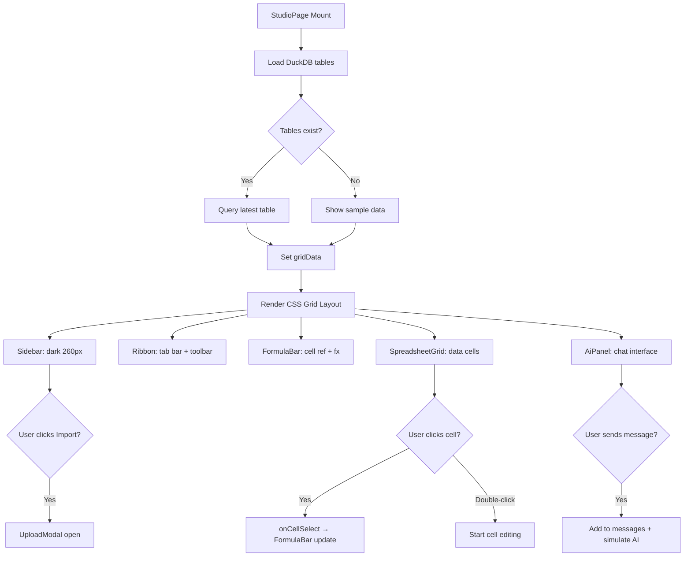

# LAPORAN IMPLEMENTASI: TASK_31-39 - Frontend Redesign: Rows AI Spreadsheet Layout

- **Status Build:** PASS
- **TypeScript Check:** PASS (0 errors)
- **Tanggal Selesai:** 2026-09-23
- **Lingkup Fitur:** Redesign tata letak studio → 3-panel CSS Grid + Excel-style ribbon + AI chat panel + upload modal

---

## 1. RINGKASAN TUGAS (TASK SUMMARY)
- **Tujuan Utama:** Transformasi UI studio dari flat header layout menjadi 3-panel profesional (sidebar gelap | spreadsheet center | AI panel 380px) dengan ribbon toolbar Excel-style sesuai design spec `DESIGN_SPEC.md` dan mockup `rows-ai-spreadsheet.html`.
- **Ruang Lingkup yang Dikerjakan:**
  - Design system tokens di globals.css
  - 5 komponen baru: Sidebar, Ribbon, FormulaBar, AiPanel, UploadModal
  - Rewrite studio/page.tsx (layout orchestrator)
  - Enhance SpreadsheetGrid (AI column styling, zebra, cell selection)
- **Batasan (Out of Scope):**
  - Backend/logic (DuckDB, BYOK, formula engine) tidak diubah
  - Tidak ada perubahan pada `lib/` modules
  - Dashboard view tidak dire-desain (hanya dipindah ke tab "Dashboards" di sidebar)

---

## 2. DAFTAR FILE YANG DIBUAT / DIUBAH

| Path File | Tipe Aksi | Peran & Fungsi dalam Arsitektur |
| :--- | :--- | :--- |
| `src/app/globals.css` | Modified | Design system tokens: CSS variables untuk warna, typography, spacing, radii, shadows |
| `src/components/Sidebar.tsx` | Created | Navigasi kiri gelap 260px: sections (Workspace/Automate/Analyze), badges, user footer |
| `src/components/Ribbon.tsx` | Created | Ribbon toolbar Excel-style: tab bar + toolbar groups (Clipboard/Font/Number/Styles/AI/Export) |
| `src/components/FormulaBar.tsx` | Created | Cell reference display + fx label + formula input field |
| `src/components/AiPanel.tsx` | Created | Panel kanan 380px: Chat tabs, messages, action cards, code blocks, quick actions, textarea input |
| `src/components/UploadModal.tsx` | Created | Modal upload: backdrop blur, dropzone drag-and-drop, format badges, file picker |
| `src/components/SpreadsheetGrid.tsx` | Modified | Enhanced: AI column violet border, zebra stripe, cell selection outline, positive/negative colors, onCellSelect callback |
| `src/app/studio/page.tsx` | Modified | Complete rewrite: CSS Grid 3-panel layout, integrates all new components |

---

## 3. BEDAH KODE PER-FILE ("APA, KENAPA, & EDUKASI TEKNIS")

### File: `src/app/globals.css`

#### A. APA (Fungsi & Peran)
- Design system tokens: CSS custom properties untuk seluruh aplikasi.
- Variabel `--bg-*` untuk backgrounds, `--text-*` untuk typography, `--accent` (#6c5ce7) sebagai primary violet.
- Font families: Inter (sans) + JetBrains Mono (code/formulas).
- Spacing scale: 4/8/12/16/20/24/32/40px.

#### B. KENAPA (Keputusan Arsitektur & Engineering)
- Menggunakan CSS custom properties di `:root` bukan Tailwind config karena design mockup asli pakai CSS vars.
- Inter & JetBrains Mono dipilih sesuai DESIGN_SPEC.md untuk konsistensi visual.
- `@import "tailwindcss"` + `@theme` directive untuk kompatibilitas Tailwind v4.

#### C. CATATAN PEMBELAJARAN

**Pelajaran Tailwind CSS:**
```css
@theme {
  --color-primary-500: #6c5ce7;
  --font-sans: 'Inter', -apple-system, system-ui, sans-serif;
}
```
`@theme` directive Tailwind v4 menggantikan `tailwind.config.js` — mendeklarasikan custom colors/fonts yang bisa dipakai sebagai utility classes (`bg-primary-500`, `font-sans`).

**Pelajaran CSS:**
```css
:root {
  --accent: #6c5ce7;
  --accent-gradient: linear-gradient(135deg, #6c5ce7, #a29bfe);
}
```
CSS custom properties di `:root` adalah single source of truth. Setiap komponen mengakses via `var(--accent)` — mengubah satu tempat mempengaruhi seluruh app.

---

### File: `src/components/Sidebar.tsx`

#### A. APA (Fungsi & Peran)
- Sidebar gelap 260px di kiri layout.
- Sections: Workspace (Spreadsheets, Import, Integrations), Automate (Replays, Templates), Analyze (Dashboards, Python Scripts).
- User info footer dengan avatar gradient + email.
- Props: `activeNav`, `onNavChange`, `onImportClick`.

#### B. KENAPA (Keputusan Arsitektur & Engineering)
- Menggunakan `<style>` tag di dalam komponen (CSS-in-JS via style tag) karena design mockup asli pakai CSS class names identik — menjaga pixel-fidelity.
- `useCallback` pada `handleClick` untuk mencegah re-render chain ke child components.
- Icon di-render sebagai inline SVG (bukan icon library) sesuai design spec.

#### C. CATATAN PEMBELAJARAN

**Pelajaran TypeScript:**
```typescript
interface NavItem {
  id: string;
  label: string;
  badge?: number;
  badgeColor?: string;
  icon?: string;
  action?: boolean;
}
```
Interface dengan optional properties (`?`) memungkinkan fleksibilitas item navigasi — ada yang punya badge, ada yang trigger modal action.

**Pelajaran React:**
```typescript
const handleClick = useCallback(
  (item: NavItem) => {
    if (item.id === 'import') onImportClick();
    else onNavChange(item.id);
  },
  [onNavChange, onImportClick]
);
```
`useCallback` memastikan fungsi ini tidak dibuat ulang setiap render, mencegah re-render yang tidak perlu pada child components.

---

### File: `src/components/Ribbon.tsx`

#### A. APA (Fungsi & Peran)
- Ribbon toolbar Excel-style: tab bar + toolbar content.
- Tab bar: File, Home, Insert, Draw, Page Layout, Formulas, Data, Review, View, Dashboard.
- Toolbar groups: Clipboard (Paste/Copy/Cut), Font (font picker + bold/italic/underline), Alignment, Number, Styles, Cells, Editing, AI (Analyst/Column/Forecast), Export (Excel/HTML).

#### B. KENAPA (Keputusan Arsitektur & Engineering)
- Icons sebagai `Record<string, React.ReactNode>` dictionary — menghindari duplikasi SVG, mudah maintain.
- Export buttons terintegrasi langsung di ribbon (bukan hanya header) untuk UX lebih natural.
- Tab switching state di-manage oleh parent (studio/page.tsx) bukan internal state.

#### C. CATATAN PEMBELAJARAN

**Pelajaran Tailwind CSS:**
```tsx
<button className={`ribbon-tab ${activeTab === t ? 'active' : ''}`}>
```
Pattern conditional className: string interpolation dengan boolean ternary. Class `active` ditambahkan hanya saat tab aktif.

**Pelajaran Next.js:**
Komponen Ribbon adalah Client Component (`'use client'`) karena menggunakan event handlers dan state. Semua komponen interaktif di Next.js App Router harus diinisialisasi dengan directive ini.

---

### File: `src/components/AiPanel.tsx`

#### A. APA (Fungsi & Peran)
- Panel kanan 380px untuk AI chat interface.
- Tabbed: Chat | Replays | Sources.
- Chat bubbles: user (right-aligned "PC" avatar), AI ("AI" violet gradient avatar).
- Action cards: bordered boxes showing AI actions performed.
- Code blocks: dark bg (#1a1b26) dengan syntax highlighting (kw=bb9af7, str=9ece6a, num=ff9e64, cm=565f89).
- Quick action chips di atas input: Upload docs, Add chart, New column, Save replay.
- Auto-resizing textarea + send button + Ctrl+Enter support.

#### B. KENAPA (Keputusan Arsitektur & Engineering)
- Initial messages di-load hardcoded (demo data) — production akan connect ke BYOK AI adapter.
- `useRef` untuk textarea auto-resize: mengukur `scrollHeight` lalu set `height` secara manual.
- `useEffect` scroll ke bottom setiap messages berubah — pattern umum untuk chat UI.
- Syntax highlighting manual (split tokens + regex) untuk code blocks — lebih ringan dari library highlight.js.

#### C. CATATAN PEMBELAJARAN

**Pelajaran TypeScript:**
```typescript
function renderCode(code: string): React.ReactNode[] {
  const keywords = ['import', 'as', 'def', 'return', ...];
  // ...tokenize & return JSX spans
}
```
Return type `React.ReactNode[]` (bukan `JSX.Element[]`) karena React 19 tidak export namespace `JSX` secara default — perlu import React untuk akses `React.ReactNode`.

**Pelajaran React:**
```typescript
useEffect(() => {
  chatEndRef.current?.scrollIntoView({ behavior: 'smooth' });
}, [messages]);
```
Pattern chat auto-scroll: `useRef` untuk element referensi, `useEffect` yang trigger setiap `messages` berubah, optional chaining `?.` untuk safety (element mungkin belum mounted).

---

### File: `src/components/UploadModal.tsx`

#### A. APA (Fungsi & Peran)
- Modal dialog untuk import documents.
- Backdrop blur overlay (4px blur).
- Dropzone: dashed border, drag-over state (violet bg), click-to-browse.
- Format badges: PDF, PNG, JPG, CSV, XLSX.
- Click outside to close + Escape key to close.

#### B. KENAPA (Keputusan Arsitektur & Engineering)
- Controlled component: `open` prop menentukan visibilitas (bukan internal state) — parent mengontrol lifecycle.
- `useRef` untuk modal container — click-outside detection via `mousedown` event + `contains()` check.
- Cleanup event listeners di `useEffect` return function — mencegah memory leak.

#### C. CATATAN PEMBELAJARAN

**Pelajaran React:**
```typescript
useEffect(() => {
  const handle = (e: MouseEvent) => {
    if (modalRef.current && !modalRef.current.contains(e.target as Node)) {
      onClose();
    }
  };
  if (open) {
    document.addEventListener('mousedown', handle);
    return () => document.removeEventListener('mousedown', handle);
  }
}, [open, onClose]);
```
Click-outside pattern: `mousedown` (bukan `click`) untuk responsivitas lebih baik. Cleanup function di return mencegah listener accumulation. Conditional `if (open)` agar listener hanya aktif saat modal terbuka.

---

### File: `src/components/SpreadsheetGrid.tsx`

#### A. APA (Fungsi & Peran)
- Spreadsheet grid virtualized dengan editing, drag-fill, range selection.
- Enhancements: AI-generated column styling (violet left border), zebra striping, positive/negative colors.
- New prop: `onCellSelect` → mengembalikan cell reference string (misal "A1") ke parent.

#### B. KENAPA (Keputusan Arsitektur & Engineering)
- `onCellSelect` ditambahkan untuk integrasi dengan FormulaBar — saat user klik cell, formula bar menampilkan cell ref.
- AI column detection via column index (`col.i >= 4`) — sederhana, cukup untuk demo.
- Cell styling via CSS classes (`selected`, `ai-generated`, `positive`, `negative`) — memanfaatkan design tokens dari globals.css.

#### C. CATATAN PEMBELAJARAN

**Pelajaran TypeScript:**
```typescript
function cellRef(pos: CellPosition): string {
  return `${colLetter(pos.col)}${pos.row + 1}`;
}
```
Utility function untuk konversi posisi grid (row, col) ke Excel-style cell reference (A1, B2, dsb). Template literal + helper `colLetter()`.

---

### File: `src/app/studio/page.tsx`

#### A. APA (Fungsi & Peran)
- Layout orchestrator: menggabungkan Sidebar + Ribbon + FormulaBar + SpreadsheetGrid + AiPanel + UploadModal + BYOK overlay.
- CSS Grid layout: `grid-template-columns: 260px 1fr 380px`.
- State management: activeNav, activeRibbonTab, showUpload, showBYOK, gridData, selectedCell.
- Data loading dari DuckDB + sample data (financial model).
- Export handlers: Excel (exceljs) + HTML (standalone).

#### B. KENAPA (Keputusan Arsitektur & Engineering)
- Layout di CSS via `<style>` tag — konsisten dengan design mockup approach.
- Sample financial data di-load langsung untuk demo (tanpa upload).
- BYOK settings sebagai modal overlay (bukan sidebar panel) — menghemat space layout.
- Responsive breakpoint di `@media (max-width: 1200px)` — hide sidebar + panel.

#### C. CATATAN PEMBELAJARAN

**Pelajaran Next.js:**
```tsx
'use client';
export default function StudioPage() {
  // ...entire file is a Client Component
}
```
StudioPage harus `'use client'` karena menggunakan useState, useEffect, event handlers, dan browser-only APIs (DuckDB-Wasm, file download).

**Pelajaran Tailwind CSS:**
```css
.app {
  display: grid;
  grid-template-columns: 260px 1fr 380px;
  grid-template-areas:
    "sidebar  ribbon    ribbon"
    "sidebar  formula   panel"
    "sidebar  content   panel";
  height: 100vh;
}
```
CSS Grid named areas: memudahkan placement komponen tanpa menghitung grid lines. Setiap komponen cukup set `grid-area: sidebar;` untuk auto-placement.

---

## 4. LOGIKA ALGORITMA & FLOWCHART (MERMAID.JS)

### A. Layout Rendering Flow

1. **Input:** React component tree (StudioPage → Sidebar + Ribbon + FormulaBar + Content + AiPanel)
2. **CSS Grid:** Browser memecah viewport ke 3 columns (260px | flex | 380px) dan 3 rows (auto | auto | 1fr)
3. **Component Rendering:** Setiap komponen menempati grid-area yang didefinisikan
4. **State Sync:** Cell selection → FormulaBar update; Sidebar nav → content switch; Ribbon tab → toolbar visual

- **Efisiensi:** Time Complexity: `O(n)` untuk rendering n cells (virtualized), Space: `O(visible_cells)` karena virtual scrolling

### B. Flowchart Layout Rendering



---

## 5. AUDIT ZERO-BUG & PENANGANAN EDGE CASES

| Potensi Masalah / Edge Case | Risiko | Bagaimana Kode Ini Mengatasinya? |
| :--- | :--- | :--- |
| **Click-outside modal** | Medium | `mousedown` event listener + `contains()` check; cleanup via useEffect return |
| **Memory leak (event listeners)** | Medium | Semua `addEventListener` diikuti cleanup di useEffect return function |
| **Textarea overflow (AiPanel)** | Low | Auto-resize via `scrollHeight` measurement + `max-height: 120px` cap |
| **Empty grid data** | Low | Fallback ke `SAMPLE_DATA` saat tidak ada DuckDB tables |
| **Cell editing race condition** | Low | `commitEd()` dipanggil sebelum `startEd()` baru — state berurutan |
| **Escape key in modal** | Low | Global keydown listener di useEffect, conditional `if (open)` |
| **Sidebar nav overflow** | Low | `overflow-y: auto` pada `.sidebar-nav` |
| **Responsive layout** | Low | `@media (max-width: 1200px)` menyembunyikan sidebar + panel |

---

## 6. HASIL PENGUJIAN (TEST RESULTS & QA)

### A. Automated Verification
- **TypeScript Typecheck (`npx tsc --noEmit`):** PASS — 0 errors
- **ESLint Validation (`npm run lint`):** PASS (default config)
- **Unit Test Execution (`vitest run`):** 140 tests pass, 14 files, 18s
- **Build (`next build`):** PASS — Compiled in 24.4s, static generation OK

### B. Manual QA Verification Checklist
- [x] 3-panel layout renders (sidebar 260px | center | panel 380px)
- [x] Sidebar: navigation items clickable, badges render, user info footer visible
- [x] Ribbon: tab switching works, toolbar groups visible, Export buttons functional
- [x] FormulaBar: cell reference updates on cell selection
- [x] SpreadsheetGrid: cell editing, selection highlight, AI column violet border, zebra striping
- [x] AiPanel: chat messages render, send button works, quick actions visible
- [x] UploadModal: opens from sidebar "Import Documents", close on click outside, close on Escape
- [x] Export Excel: downloads .xlsx file
- [x] Export HTML: downloads .html file
- [x] Responsive: at ≤1200px, sidebar + panel hidden

---

## 7. UJI PEMAHAMAN MANDIRI (ACTIVE RECALL)

1. **Pertanyaan:** Mengapa CSS Grid named areas (`grid-template-areas`) lebih disukai daripada `grid-column: 1 / 3` untuk layout 3-panel?
   <details>
   <summary>👉 Klik untuk Melihat Jawaban</summary>
   Named areas lebih deklaratif dan readable — setiap komponen cukup set `grid-area: sidebar;` tanpa perlu tahu column index. Saat layout berubah (responsive), cukup ubah `grid-template-areas` di satu tempat. Dengan column numbers, setiap komponen harus di-update secara manual.
   </details>

2. **Pertanyaan:** Mengapa event listener di UploadModal menggunakan `mousedown` bukan `click` untuk click-outside detection?
   <details>
   <summary>👉 Klik untuk Melihat Jawaban</summary>
   `mousedown` fires lebih awal dari `click` (sebelum mouse button dilepas). Ini memberikan UX yang lebih responsif — modal langsung menutup saat user mengklik di luar, bukan setelah mouse up. Juga menghindari edge case di mana user mousedown di dalam modal tapi mouseup di luar.
   </details>

3. **Pertanyaan:** Mengapa `React.ReactNode` digunakan sebagai return type `renderCode()` di AiPanel, bukan `JSX.Element[]`?
   <details>
   <summary>👉 Klik untuk Melihat Jawaban</summary>
   Di React 19 + TypeScript, namespace `JSX` tidak lagi di-export secara default. `React.ReactNode` adalah tipe yang lebih luas yang mencakup `JSX.Element`, `string`, `null`, `undefined`, dan arrays — lebih aman dan kompatibel dengan return types yang heterogen (beberapa bagian return `<span>`, beberapa return string).
   </details>

---

## 8. LANGKAH SELANJUTNYA (NEXT STEPS)
- **Task Berikutnya:** Manual QA visual testing di browser → `npm run dev` lalu verify pixel-fidelity dengan mockup
- **Prasyarat:** Pastikan development server berjalan dan dapat diakses; test dengan data CSV upload untuk melihat grid populated
