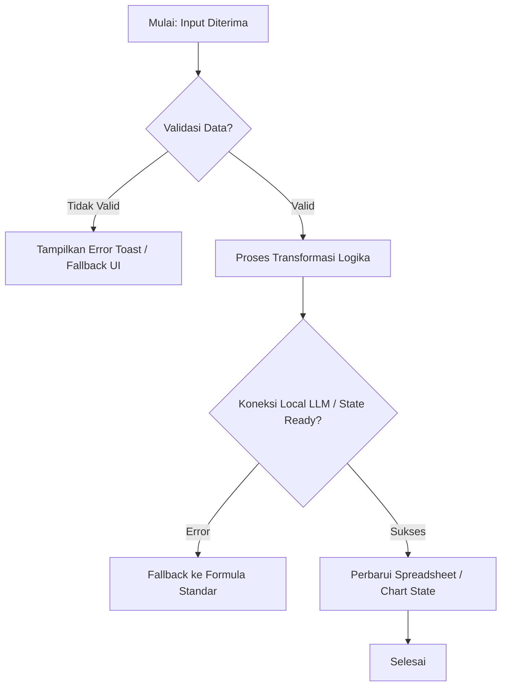

### INSTRUKSI PEMBUATAN LAPORAN KODING EDUKATIF, ALGORITMA & AUDIT BUG (POST-IMPLEMENTATION REPORT)

Bertindaklah sebagai **Senior Software Architect & Programming Instructor**. 
Kamu baru saja menyelesaikan implementasi kode untuk tugas/fitur saat ini. Sekarang, buatkan dokumen laporan komprehensif dalam format Markdown dan simpan di direktori:
`docs/reports/REPORT_[NO_TASK]_[NAMA_FITUR].md`

Laporan ini ditujukan agar saya dapat **memahami 100% logika kode, belajar konsep Next.js, TypeScript, & Tailwind CSS secara mendalam, serta memastikan kode bebas dari celah bug**.

Susun laporan dengan struktur WAJIB berikut:

---

#### 1. RINGKASAN FITUR & STRUKTUR FILE
- Sebutkan fitur apa yang baru saja diselesaikan.
- Tampilkan daftar file yang dibuat atau diubah beserta fungsi ringkasnya dalam satu tabel.

---

#### 2. BEDAH KODE PER-FILE: "APA, KENAPA, DAN TUJUAN PEMBELAJARAN"
Bahas setiap file yang baru saja kamu kerjakan satu per satu dengan format 3 pilar:

- **A. APA (Fungsi Komponen/Skrip):**
  Jelaskan apa peran skrip ini di dalam aplikasi. Input apa yang diterima (props/arguments) dan output apa yang dihasilkan.
- **B. KENAPA (Keputusan Arsitektur & Rekayasa):**
  Mengapa kamu memilih pendekatan ini? Mengapa memilih hook/pola tertentu dibanding alternatif lainnya?
  *(Contoh: Mengapa memakai `useMemo` dibanding `useEffect`? Mengapa memakai Server Component dibanding Client Component?)*
- **C. TUJUAN PEMBELAJARAN (Next.js, TypeScript & Tailwind CSS):**
  Ambil 2–3 potongan kode menarik dari file ini dan jelaskan konsep dasarnya kepada saya:
  - **Pelajaran TypeScript:** Jelaskan penggunaan `interface`, `generics`, `utility types`, atau cara penanganan `null/undefined`.
  - **Pelajaran Next.js:** Jelaskan konsep siklus hidup komponen, rendering, atau optimasi yang terjadi.
  - **Pelajaran Tailwind CSS:** Jelaskan kombinasi kelas CSS yang menarik (misal: teknik Flexbox/Grid, transisi animasi, atau responsivitas `md:` / `lg:`).

---

#### 3. LOGIKA ALGORITMA & FLOWCHART VISUAL (MERMAID.JS)
Jika fitur ini memproses data (misal: parsing formula Excel, sanitasi prompt AI, agregasi data grafik, atau pembuat file zip/blob):

- **Penjelasan Langkah Algoritma:** Tuliskan langkah logikanya secara runut (Input ➡️ Validasi ➡️ Transformasi ➡️ Output).
- **Kompleksitas (Big-O):** Jelaskan efisiensi waktu (*Time Complexity*) dan memori (*Space Complexity*).
- **Flowchart Visual:** Buat diagram alur logika menggunakan sintaks **Mermaid.js** (`graph TD` atau `flowchart TD`) yang lengkap dengan percabangan kondisi (kondisi sukses, gagal/error, fallback).

---

#### 4. BEDAH POTENSI BUG & EDGE CASES (ZERO-BUG AUDIT)
Analisis secara jujur dan kritis bagian mana dari kode ini yang paling rentan terhadap kesalahan, dan bagaimana kode saat ini mengatasinya:

1. **Race Condition / State Delay:** Apakah ada operasi asynchronous yang berisiko bertabrakan jika pengguna mengklik tombol berkali-kali?
2. **Memory Leaks:** Apakah ada event listener, instance chart, atau interval yang wajib di-cleanup saat komponen unmount?
3. **Edge Cases Data:** Bagaimana kode bereaksi jika data bernilai `null`, `undefined`, string kosong `""`, atau format angka tidak lazim (misal: koma vs titik desimal)?
4. **Penanganan Error (Error Boundary / Fallback):** Apa yang tampil di layar pengguna jika API/Local LLM tiba-tiba offline atau mati di tengah jalan?

---

#### 5. UJI REFLEKSI PEMAHAMAN (ACTIVE RECALL CHECK)
Berikan **3 pertanyaan teknis singkat** (beserta jawabannya yang disembunyikan menggunakan tag `<details><summary>Lihat Jawaban</summary>... </details>`) berdasarkan kode yang baru saja ditulis, agar saya bisa menguji apakah saya sudah memahami logika koding yang baru dipelajari.

---

### ATURAN PENULISAN:
- Gunakan Bahasa Indonesia teknis yang lugas, terstruktur, dan mudah dipahami oleh programmer pemula hingga menengah.
- Pastikan sintaks Mermaid.js valid agar dapat dirender sempurna di Markdown preview (VS Code / GitHub).


 jalankan INSTRUKSI PEMBUATAN LAPORAN KODING EDUKATIF untuk fitur ini dan simpan laporannya ke folder docs/reports/

 Pesan di atas adalah respon dari AI coding agent Anda (seperti Cursor, Windsurf, atau Claude Code) karena file template acuannya belum ada di dalam repositori.

Berikut adalah isi template lengkap yang siap Anda simpan menjadi file **`format_laporan_code.md`** di root folder proyek Anda.

---

### Langkah 1: Buat File `format_laporan_code.md`
Buat file baru di root project Anda dengan nama **`format_laporan_code.md`**, lalu salin seluruh isi di bawah ini ke dalamnya:

```markdown
# TEMPLATE STANDAR LAPORAN IMPLEMENTASI KODE (RANCAGÉ STUDIO)

> **Instruksi untuk AI Agent:**  
> Gunakan struktur dokumen ini untuk setiap laporan yang disimpan ke dalam folder `docs/reports/REPORT_[TASK_ID]_[NAMA_FITUR].md`.  
> Semua penjelasan teknis wajib berorientasi edukatif untuk membantu pengembang memahami **Next.js, TypeScript, dan Tailwind CSS** serta mencegah timbulnya bug.

---

# LAPORAN IMPLEMENTASI: [TASK_ID] - [NAMA FITUR]

- **Status Build:** [PASS / FAIL]
- **TypeScript Check:** [PASS (0 errors) / FAIL]
- **Tanggal Selesai:** [YYYY-MM-DD]
- **Lingkup Fitur:** [Contoh: Milestone 1 - Inisialisasi BYOK & Model Manager]

---

## 1. RINGKASAN TUGAS (TASK SUMMARY)
- **Tujuan Utama:** [Jelaskan apa masalah atau kebutuhan pengguna yang diselesaikan oleh fitur ini]
- **Ruang Lingkup yang Dikerjakan:** [Daftar poin pekerjaan yang diselesaikan]
- **Batasan (Out of Scope):** [Hal yang sengaja ditunda ke tahap berikutnya]

---

## 2. DAFTAR FILE YANG DIBUAT / DIUBAH

| Path File | Tipe Aksi | Peran & Fungsi dalam Arsitektur |
| :--- | :--- | :--- |
| `src/...` | Created / Modified | [Penjelasan ringkas 1 kalimat] |
| `src/...` | Created / Modified | [Penjelasan ringkas 1 kalimat] |

---

## 3. BEDAH KODE PER-FILE ("APA, KENAPA, & EDUKASI TEKNIS")

### File: `[Path/File/Pertama.tsx]`

#### A. APA (Fungsi & Peran)
- **Fungsi:** [Jelaskan komponen/modul ini menerima props/input apa dan menghasilkan output apa]

#### B. KENAPA (Keputusan Arsitektur & Engineering)
- **Alasan Pemilihan Pola/Hook:** [Contoh: Kenapa memakai `useCallback`? Kenapa state ditaruh di sini dan bukan di global context?]

#### C. CATATAN PEMBELAJARAN (Next.js, TypeScript, & Tailwind CSS)
Tampilkan 1–2 blok kode penting dari file ini dengan penjelasan edukatif:

```typescript
// Contoh cuplikan kode dari implementasi
export interface MyComponentProps {
  data: RowData[];
  onSelect: (id: string) => void;
}
```
- **Pelajaran TypeScript:** [Jelaskan mengapa interface ini didefinisikan seperti itu, bagaimana type safety mencegah runtime error]
- **Pelajaran Next.js:** [Jelaskan apakah ini Client/Server Component, siklus hidup rendering, atau optimasi bundle]
- **Pelajaran Tailwind CSS:** [Jelaskan kombinasi class Tailwind yang dipakai, trik flex/grid, atau dark mode styling]

---

## 4. LOGIKA ALGORITMA & FLOWCHART (MERMAID.JS)

### A. Tahapan Algoritma
1. **Input:** [Data mentah yang masuk]
2. **Validasi & Sanitasi:** [Aturan pengecekan format, null checks]
3. **Transformasi:** [Operasi matematika, parsing rumus Excel, atau agregasi data]
4. **Output:** [Data terstruktur akhir yang diteruskan ke komponen/file]
- **Efisiensi:** Time Complexity: `O(...)`, Space Complexity: `O(...)`

### B. Flowchart Logika


---

## 5. AUDIT ZERO-BUG & PENANGANAN EDGE CASES

| Potensi Masalah / Edge Case | Risiko | Bagaimana Kode Ini Mengatasinya? |
| :--- | :--- | :--- |
| **Race Condition / Rapid Clicks** | High / Medium / Low | [Misal: Menggunakan flag loading / abort controller] |
| **Data Null / Undefined** | High / Medium / Low | [Misal: Optional chaining `?.` dan fallback default value `?? []`] |
| **Memory Leak (Unmounted Component)** | High / Medium / Low | [Misal: Cleanup function di `useEffect` untuk destroy instance chart] |
| **Endpoint AI Offline / Timeout** | High / Medium / Low | [Misal: Try-catch block dengan pesan error user-friendly] |

---

## 6. HASIL PENGUJIAN (TEST RESULTS & QA)

### A. Automated Verification
- **TypeScript Typecheck (`npx tsc --noEmit`):** [Hasil output, pastikan 0 error]
- **ESLint Validation (`npm run lint`):** [Hasil output linting]
- **Unit Test Execution:** [Jika ada test runner yang berjalan]

### B. Manual QA Verification Checklist
- [x] Skenario 1: [Langkah uji dan hasil yang terverifikasi]
- [x] Skenario 2: [Langkah uji dan hasil yang terverifikasi]
- [x] Skenario 3: [Langkah uji dan hasil yang terverifikasi]

---

## 7. UJI PEMAHAMAN MANDIRI (ACTIVE RECALL)

Jawab 3 pertanyaan refleksi ini untuk menguji pemahaman Anda terhadap kode yang baru dibuat:

1. **Pertanyaan:** [Pertanyaan konsep TypeScript / Next.js terkait kode di atas]
   <details>
   <summary>👉 Klik untuk Melihat Jawaban</summary>
   [Jawaban rinci]
   </details>

2. **Pertanyaan:** [Pertanyaan konsep arsitektur atau state]
   <details>
   <summary>👉 Klik untuk Melihat Jawaban</summary>
   [Jawaban rinci]
   </details>

3. **Pertanyaan:** [Pertanyaan penanganan bug atau edge case]
   <details>
   <summary>👉 Klik untuk Melihat Jawaban</summary>
   [Jawaban rinci]
   </details>

---

## 8. LANGKAH SELANJUTNYA (NEXT STEPS)
- **Task Berikutnya:** [Sebutkan Task/Milestone berikutnya yang siap dikerjakan]
- **Prasyarat:** [Apa yang perlu disiapkan sebelum masuk ke task berikutnya]
```

---

### Langkah 2: Balas Pesan AI Agent Anda
Setelah file `format_laporan_code.md` tersimpan, kirimkan balasan ini ke AI Agent Anda di chat:

> *"Saya sudah membuat file `format_laporan_code.md` di root project. Silakan gunakan template di dalam file tersebut untuk membuat laporan coding setiap kali sebuah task selesai dikerjakan, dan simpan hasilnya di folder `docs/reports/`."*